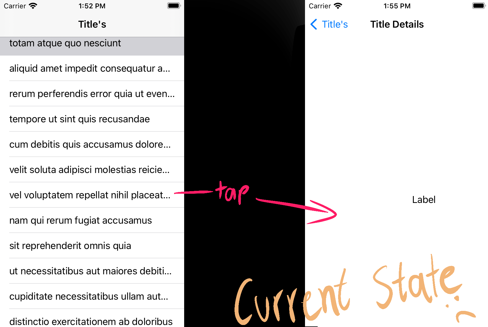
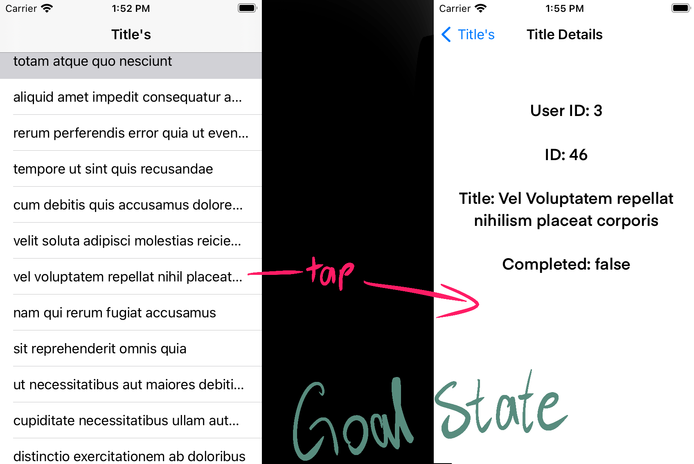

#  API filling in a table and label

using data from this api: https://jsonplaceholder.typicode.com/todos, I have built the table in the screen shots below. Now I am trying to 'expand' the table so that users can view more information about the title they selected. The second screen shot below is what I am trying to accomplish.

### this is what I currently have: 

 
 ### and this is what I am trying to build: 

